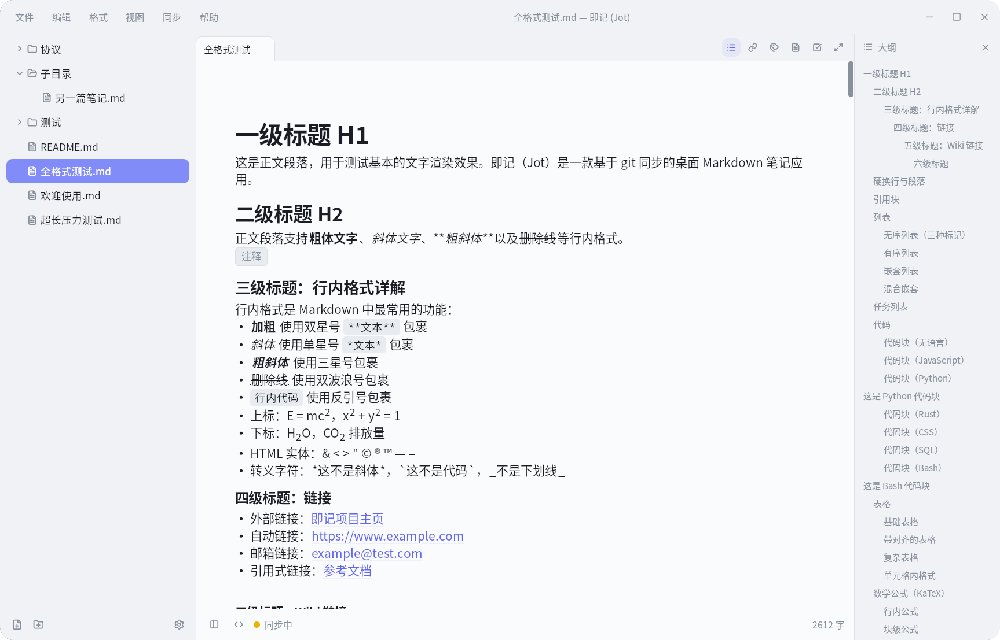

# 即记 (Jot)

> 基于 Git 同步的桌面 Markdown 笔记应用 —— 笔记即 `.md` 文件，直接操作你的文件系统，无需导入/导出。

<p align="center">
  
  
  
</p>

Jot 是一款 **Tauri 2** 驱动的跨平台桌面笔记工具，工作方式类似 VS Code 或 IDEA：笔记就是磁盘上按真实目录组织的 Markdown 文件，没有数据库，没有专有格式。内置 Git 同步引擎，让你的笔记在多设备间自动同步。

<p align="center">
  
</p>

## ✨ 功能特性

- **📝 所见即所得编辑** — 基于 CodeMirror 6 的自定义即时渲染引擎，隐藏 Markdown 语法标记，直接显示格式化效果（粗体、标题、表格、图片、复选框等），切换源码模式即可编辑原始 Markdown
- **🔄 Git 自动同步** — 内置同步引擎：编辑停笔 2 秒自动保存，空闲 30 秒自动提交，每 5 分钟自动推拉，冲突时智能处理并保留冲突副本
- **📂 原生文件系统** — 笔记直接存储在磁盘上，按真实目录组织。拖入图片自动存入 `.assets/` 目录，与其他编辑器完全兼容
- **🔗 双向链接** — `[[wiki 链接]]` 自动补全，反向链接面板追踪引用关系，构建个人知识图谱
- **🔍 全文搜索** — `Cmd+P` 命令面板同时搜索文件名与正文内容，实时匹配，快速直达任意笔记
- **📋 模板系统** — 在 `_templates/` 目录预置笔记模板，新建时一键套用，支持 `{{title}}`、`{{date}}`、`{{time}}` 等变量自动替换
- **📊 丰富内容** — 数学公式（KaTeX）、Mermaid 图表、表格、代码块（语法高亮）、图片、任务复选框
- **🏷️ 标签与元数据** — 从 YAML frontmatter 自动提取标签，侧边栏按标签浏览笔记，元数据面板可视编辑
- **✅ 待办聚合** — 跨笔记聚合所有任务清单，在待办面板统一查看与勾选，写作与行动两不误
- **📤 多格式导出** — HTML（自包含 KaTeX 公式字体）、PNG 截图、PDF，以及 Pandoc 转换的 DOCX / EPUB / LaTeX，支持直接打印
- **🔌 MCP 集成** — 内置 MCP 侧车（sidecar）服务，允许 AI 助手直接读取你的笔记内容
- **🎨 双主题** — 亮色/暗色模式，对齐飞书文档设计语言
- **⌨️ 高效操作** — 命令面板（`Cmd+P`）、多标签页、文档大纲导航、中文查找替换面板、Emoji 选择器、丰富的键盘快捷键
- **🖥️ 跨平台** — Windows、macOS、Linux 原生桌面体验，含系统托盘、单实例锁

## 🛠 技术栈

| 层 | 技术 |
|---|------|
| **桌面框架** | [Tauri 2](https://tauri.app/)（Rust 后端 + Web 前端） |
| **前端** | React 18 + TypeScript + Tailwind CSS 3.4 |
| **编辑器** | CodeMirror 6 + 自定义即时渲染装饰器 |
| **状态管理** | Zustand 5 |
| **数学公式** | KaTeX |
| **图表** | Mermaid |
| **Markdown 解析** | Lezer (CodeMirror) / Marked |
| **导出** | snapdom / Pandoc |
| **构建工具** | Vite 5 + pnpm |

## 📦 安装

### 下载预编译包

前往 [Releases](https://github.com/fatefl/jot/releases) 页面下载对应平台安装包：
- **macOS**：`.dmg`
- **Windows**：`.msi` / `.exe`
- **Linux**：`.deb` / `.AppImage`

### 从源码构建

**前置要求：**
- [Rust](https://rustup.rs/)（最新稳定版）
- [Node.js](https://nodejs.org/) >= 18 + [pnpm](https://pnpm.io/installation)
- Linux 需安装 `libwebkit2gtk-4.1-dev`、`libgtk-3-dev` 等系统依赖（参考 [Tauri 前置要求](https://v2.tauri.app/start/prerequisites/)）

```bash
# 克隆仓库
git clone https://github.com/fatefl/jot.git
cd jot

# 安装依赖
pnpm install

# 准备 MCP sidecar（首次构建需要）
bash scripts/prepare-sidecar.sh

# 开发模式启动
pnpm tauri dev

# 生产构建
pnpm tauri build
```

## 🚀 快速开始

1. 启动应用后，跟随引导向导选择笔记存放目录
2. （可选）配置 Git 远程仓库实现多设备同步
3. 在侧边栏右键创建新笔记或文件夹
4. 开始写作 —— 笔记自动保存，后台自动同步

## 🏗 项目架构

```
jot/
├── src/                    # React 前端
│   ├── components/         # UI 组件（Editor、Sidebar、TabBar、StatusBar…）
│   ├── lib/                # 核心库（livePreview、linkActions、editorKeymap…）
│   ├── stores/             # Zustand 状态管理（5 个 store）
│   ├── hooks/              # 自定义 Hook（自动保存、同步定时器、键盘快捷键…）
│   └── menus/              # 菜单定义
├── src-tauri/              # Rust 后端
│   ├── src/lib.rs          # Tauri commands（文件 I/O、Git 操作、配置管理）
│   └── src/menu.rs         # macOS 原生菜单
├── src-mcp/                # MCP sidecar（Rust）
│   └── src/main.rs         # MCP 服务实现
├── scripts/                # 构建辅助脚本
├── docs/                   # 文档
└── test/                   # 测试
```

## 🔧 开发

```bash
pnpm dev              # Vite 开发服务器（仅前端，端口 1420）
pnpm tauri dev        # 完整 Tauri 桌面应用
pnpm build            # TypeScript 类型检查 + Vite 生产构建
pnpm test             # 运行全部测试
pnpm test -- --run <pattern>  # 按模式筛选测试
pnpm tauri build      # 生产环境桌面打包
```

### MCP Sidecar

Jot 内置 MCP（Model Context Protocol）服务，允许支持 MCP 的 AI 助手直接访问笔记内容。构建与使用说明见应用内置的「MCP 配置指南」（帮助菜单，或 `src-tauri/resources/MCP 配置指南.md`）。

```bash
# 构建 MCP sidecar
cargo build --release --manifest-path src-mcp/Cargo.toml
```

## ⚙️ 配置

应用配置存储在：
- macOS：`~/Library/Application Support/cc.apidata.jot/`
- Linux：`~/.config/notes/`（或系统 XDG 配置目录）
- Windows：`%APPDATA%/cc.apidata.jot/`

Git 凭据在配置文件和 OS keyring 之间有自动降级机制。

## 📄 许可

本项目采用 **MIT License** 开源，完整许可文本见 [LICENSE](LICENSE)。

- **代码**：即记 (Jot) 的源代码按 MIT 许可证授权，可自由使用、复制、修改、分发。
- **第三方依赖**：本项目使用了 Tauri、React、CodeMirror 6、KaTeX、Mermaid、Zustand 等开源组件，各自遵循其自身许可证。

## 🤝 贡献

- **报告问题**：请通过 [Issues](https://github.com/fatefl/jot/issues) 提交，描述问题现象、复现步骤及系统环境。
- **提交代码**：Fork 本仓库，提交 Pull Request。请确保 `pnpm build` 与 `pnpm test` 通过。
- **构建依赖**：新克隆仓库后，先执行 `bash scripts/prepare-sidecar.sh` 准备 MCP sidecar，再运行 `pnpm tauri dev`。
- **其他联系**：hi@apidata.cc

---

**即记 (Jot)** — 记你所想，处处可及。
