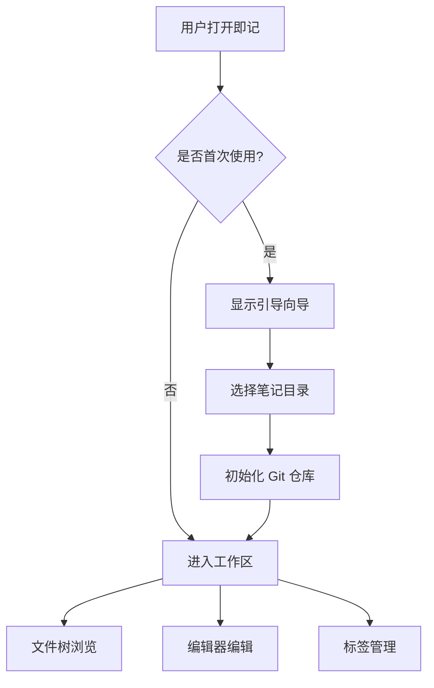
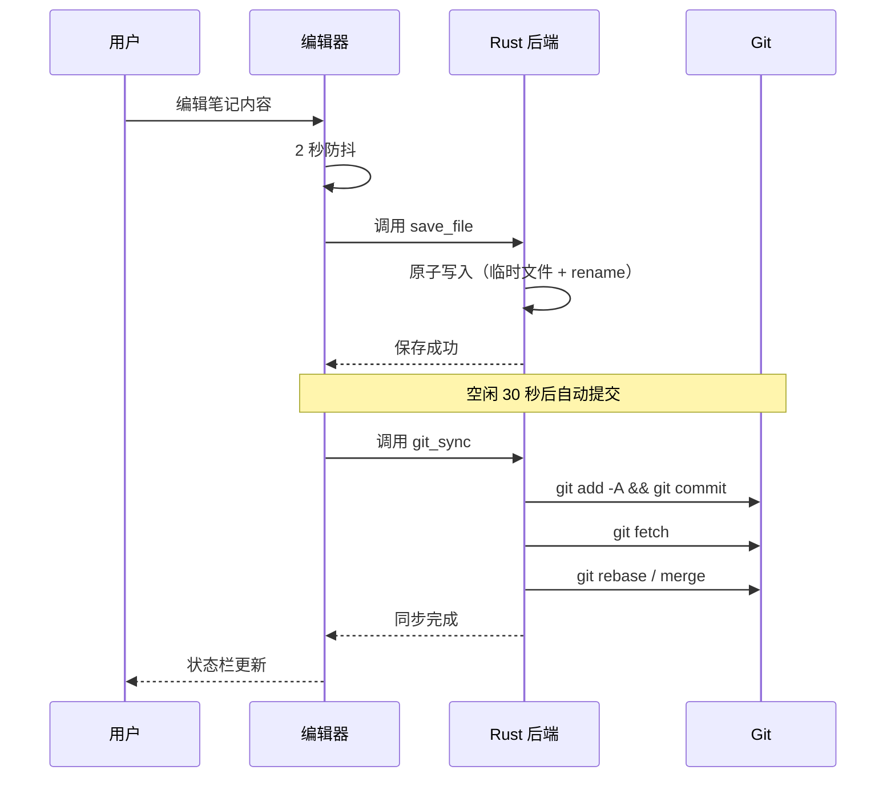

# 一级标题 H1

这是正文段落，用于测试基本的文字渲染效果。即记（Jot）是一款基于 git 同步的桌面 Markdown 笔记应用。

## 二级标题 H2

正文段落支持**粗体文字**、*斜体文字*、**_粗斜体_**以及~~删除线~~等行内格式。

<!-- 这是 HTML 注释，在所见即所得模式下应该被隐藏 -->

### 三级标题：行内格式详解

行内格式是 Markdown 中最常用的功能：
- **加粗** 使用双星号 `**文本**` 包裹
- *斜体* 使用单星号 `*文本*` 包裹
- ***粗斜体*** 使用三星号包裹
- ~~删除线~~ 使用双波浪号包裹
- `行内代码` 使用反引号包裹
- 上标：E = mc^2^，x^2^ + y^2^ = 1
- 下标：H~2~O，CO~2~ 排放量
- HTML 实体：&amp; &lt; &gt; &quot; &copy; &reg; &trade; &mdash; &ndash;
- 转义字符：\*这不是斜体\*，\`这不是代码\`，\_不是下划线\_

#### 四级标题：链接

- 外部链接：[即记项目主页](https://github.com)
- 自动链接：<https://www.example.com>
- 邮箱链接：<example@test.com>
- 引用式链接：[参考文档][ref1]

[ref1]: https://example.com/ref "参考链接定义（WYSIWYG 下应隐藏）"

##### 五级标题：Wiki 链接

在即记中使用 `[[` 触发笔记自动补全，支持按标题和路径匹配：
- [[其他笔记标题]]
- [[子目录/另一篇笔记]]

###### 六级标题

最小的标题级别，用于深层嵌套结构。

---

## 硬换行与段落

这是第一行，末尾有两个空格——  
这是第二行（硬换行）。硬换行在所见即���得模式下显示为 ↵ 符号。

这是另一个段落，
中间有普通换行（非硬换行），在渲染时合并为空格。

---

## 引用块

> 这是单行引用块。子曰：学而时习之，不亦说乎？
>
> 这是引用块内的第二个段落。
>
> > 嵌套引用块——一层套一层。
> >
> > > 三层嵌套引用，测试深层引用样式。

> **引用块内的格式**：包含 *斜体*、~~删除线~~、`代码` 等。
>
> - 引用块内的列表
> - 第二项
>
> 1. 有序列表
> 2. 第二项

---

## 列表

### 无序列表（三种标记）

- 减号列表项 `-`
- 另一个减号项

* 星号列表项 `*`
* 另一个星号项

+ 加号列表项 `+`
+ 另一个加号项

### 有序列表

1. 第一项
2. 第二项
3. 第三项

1. 数字可以乱写
1. 渲染时自动递增
1. 第三个条目

### 嵌套列表

- 一级项目
  - 二级项目（缩进 2 空格）
    - 三级项目（缩进 4 空格）
  - 回到二级
- 回到一级

1. 有序一级
   1. 有序二级
      1. 有序三级
   2. 有序二级第二项
2. 有序一级第二项

### 混合嵌套

- 无序外层
  1. 有序内层
  2. 有序内层第二项
- 回到无序

1. 有序外层
   - 无序内层
   - 无序内层第二项

---

## 任务列表

- [ ] 未完成的任务：写测试文档
- [x] 已完成的任务：搭建项目框架
- [ ] 未完成：实现所见即所得编辑器
- [x] 已完成：CodeMirror 6 集成
- [ ] 嵌套任务
  - [x] 子任务 1（已完成）
  - [ ] 子任务 2（未完成）

---

## 代码

### 代码块（无语言）

```
function hello() {
  console.log("Hello, 即记！");
  return "没有指定语言的代码块";
}
```

### 代码块（JavaScript）

```javascript
// 这是 JavaScript 代码块
const greet = (name) => {
  return `你好，${name}！欢迎使用即记`;
};

class NoteManager {
  constructor(path) {
    this.path = path;
  }

  async save(content) {
    // 原子写入：临时文件 + rename
    await fs.writeFile(this.path, content, "utf-8");
  }
}
```

### 代码块（Python）

```python
# 这是 Python 代码块
def fibonacci(n: int) -> list[int]:
    """生成斐波那契数列"""
    a, b = 0, 1
    result = []
    for _ in range(n):
        result.append(a)
        a, b = b, a + b
    return result

print(fibonacci(10))  # [0, 1, 1, 2, 3, 5, 8, 13, 21, 34]
```

### 代码块（Rust）

```rust
// 这是 Rust 代码块
use std::fs;
use std::path::PathBuf;

pub fn list_tree(root: &PathBuf) -> Vec<String> {
    let mut entries: Vec<String> = fs::read_dir(root)?
        .filter_map(|e| e.ok())
        .filter(|e| !e.file_name().to_str().unwrap_or("").starts_with('.'))
        .map(|e| e.file_name().to_string_lossy().into_owned())
        .collect();
    entries.sort();
    entries
}
```

### 代码块（CSS）

```css
/* 这是 CSS 代码块 */
.lp-h1 {
  font-size: 1.8em;
  font-weight: 700;
  color: var(--text-primary);
  margin: 0.8em 0 0.4em;
}

.lp-strong {
  font-weight: 700;
  color: var(--text-primary);
}
```

### 代码块（SQL）

```sql
-- 这是 SQL 代码块
SELECT
  notes.title,
  notes.created_at,
  tags.name AS tag_name
FROM notes
LEFT JOIN note_tags ON notes.id = note_tags.note_id
LEFT JOIN tags ON note_tags.tag_id = tags.id
WHERE notes.archived = 0
ORDER BY notes.updated_at DESC
LIMIT 50;
```

### 代码块（Bash）

```bash
#!/bin/bash
# 这是 Bash 代码块
echo "当前分支：$(git branch --show-current)"
pnpm tauri build --debug
```

---

## 表格

### 基础表格

| 姓名 | 年龄 | 城市 | 职业 |
|------|------|------|------|
| 张三 | 28 | 北京 | 工程师 |
| 李四 | 32 | 上海 | 设计师 |
| 王五 | 25 | 深圳 | 产品经理 |

### 带对齐的表格

| 左对齐 | 居中对齐 | 右对齐 |
|:-------|:-------:|-------:|
| 文本 | 文本 | 123 |
| 长文本内容 | 中等 | 45.67 |
| a | b | c |

### 复杂表格

| 功能 | 快捷键 | 平台 | 说明 |
|:-----|:------:|:----:|:-----|
| 加粗 | `Cmd+B` | 全平台 | 切换粗体 |
| 斜体 | `Cmd+I` | 全平台 | 切换斜体 |
| 行内代码 | `Cmd+E` | 全平台 | 切换代码标记 |
| 链接 | `Cmd+K` | 全平台 | 插入/编辑链接 |
| 表格上方插入行 | `Cmd+Shift+↑` | 全平台 | 表格光标下有效 |
| 表格下方插入行 | `Cmd+Shift+↓` | 全平台 | 表格光标下有效 |

### 单元格内格式

| 产品 | **价格** | *备注* |
|------|---------|--------|
| 笔记本 | `¥29.99` | ~~原价 ¥39.99~~ |
| 钢笔 | `¥15.00` | 热销款 |
| 便签 | `¥5.50` | 买三送一 |

---

## 数学公式（KaTeX）

### 行内公式

质能方程 $E = mc^2$ 可能是最著名的物理公式。一元二次方程 $ax^2 + bx + c = 0$ 的解为 $x = \frac{-b \pm \sqrt{b^2 - 4ac}}{2a}$。

### 块级公式

$$
\int_{-\infty}^{\infty} e^{-x^2} \, dx = \sqrt{\pi}
$$

$$
\begin{pmatrix}
a & b \\
c & d
\end{pmatrix}
\begin{pmatrix}
x \\
y
\end{pmatrix}
=
\begin{pmatrix}
ax + by \\
cx + dy
\end{pmatrix}
$$

$$
\sum_{n=1}^{\infty} \frac{1}{n^2} = \frac{\pi^2}{6}
$$

---

## Mermaid 图表





---

## 图片

### 本地图片带缩放

<!-- 下方为示例路径，实际使用请替换为真实图片路径 -->


### 全尺寸图片


### 无缩放图片


---

## 分割线（多种风格）

三个或更多的星号：

---

三个或更多的短横线：

---

三个或更多的下划线：

---

---

## HTML（所见即所得下隐藏）

<div style="border: 1px solid #ccc; padding: 16px; border-radius: 8px;">
  <p>这是一个 <strong>HTML 块</strong>，在所见即所得模式下应该被隐藏不显示。</p>
</div>

<span style="color: red;">内联 HTML 标签在 WYSIWYG 下也应隐藏</span>

---

## 综合测试区域

### 混合内容

> **提示：** 即记支持 *多种格式* 的 —— 混合使用。参考 [Markdown 指南](https://www.markdownguide.org)。
>
> - `Cmd+B` 加粗
> - `Cmd+I` 斜体
> - `Cmd+E` 行内代码
>
> 更多信息参见 [[快速入门]] 笔记。

### 复杂嵌套

- [ ] **重要任务**：完成全格式测试
  - 包含 ~~已废弃的格式说明~~
  - 引用 `相关文档` 中的 *注意事项*
  - > 子项引用块：确保嵌套正确
  - 1. 子有序列表
  - 2. 第二项
- [x] 已完成项：验证表格功能

### 极端测试

1. 非常长的行内代码：`const extremelyLongVariableName = someFunction(parameter1, parameter2, parameter3).map(item => item.transform().normalize()).filter(Boolean);`

2. 多层嵌套引用：

> 一层
> > 二层
> > > 三层
> > > > 四层
> > > > > 五层
> > > > > > 六层

3. 混合列表缩进：
   - 第一级
     - 第二级
       - 第三级
         - 第四级
     - 回到第二级
   - 回到第一级

---

## 全文完

本文档覆盖了即记编辑器支持的全部 Markdown 格式：

| # | 格式类型 | 状态 |
|:--|:---------|:----:|
| 1 | 标题 H1-H6 | ✅ |
| 2 | 粗体 / 斜体 / 粗斜体 | ✅ |
| 3 | 删除线 | ✅ |
| 4 | 行内代码 | ✅ |
| 5 | 上标 / 下标 | ✅ |
| 6 | HTML 实体 | ✅ |
| 7 | 转义字符 | ✅ |
| 8 | 外部链接 / 自动链接 | ✅ |
| 9 | Wiki 链接 `[[]]` | ✅ |
| 10 | 引用块（含嵌套） | ✅ |
| 11 | 无序 / 有序 / 任务列表 | ✅ |
| 12 | 代码块（多语言） | ✅ |
| 13 | 表格（含对齐/工具栏） | ✅ |
| 14 | 数学公式（KaTeX 行内/块级） | ✅ |
| 15 | Mermaid 图表 | ✅ |
| 16 | 图片（含缩放） | ✅ |
| 17 | 分割线 | ✅ |
| 18 | HTML 块/注释（WYSIWYG 隐藏） | ✅ |
| 19 | 硬换行 | ✅ |
| 20 | YAML Frontmatter | ✅ |

**测试日期：** 2026-07-30
**应用版本：** v0.1.10
